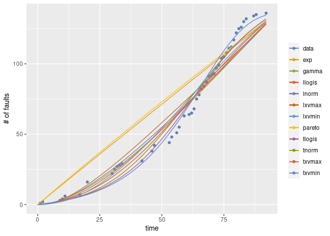
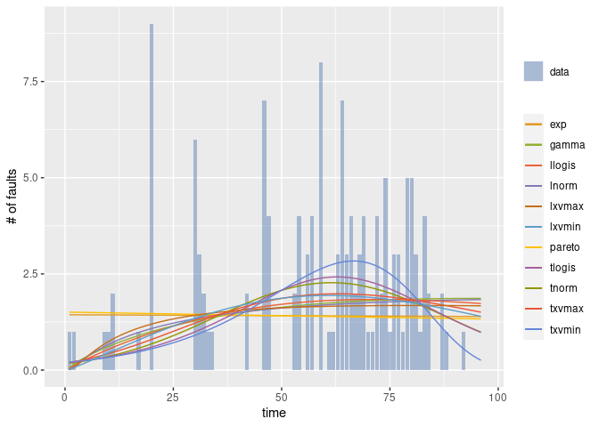
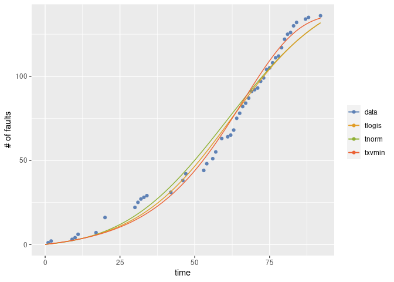
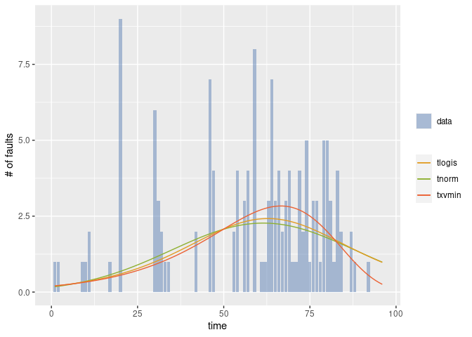
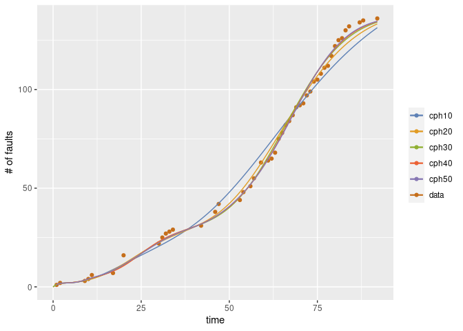
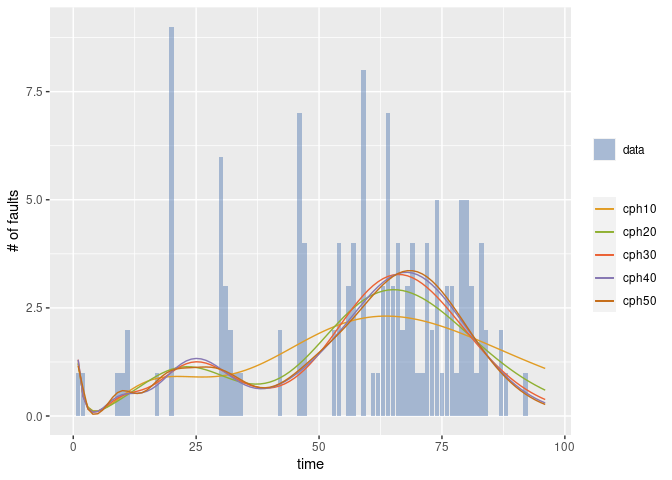

<!-- README.md is generated from README.Rmd. Please edit that file -->

# gof4srm

gof4srm provides Kolmogorov-Smirnov test for both time and grouped data,
and EIC (extended information criterion) for software reliability growth
models.

## Installation

You can install gof4srm from GitHub with:

``` r
install.packages("devtools")
devtools::install_github("SwReliab/gof4srm")
```

Alternatively, you can use Remote to install Rsrat from GitHub

``` r
install.packages("remotes")
remotes::install_github("SwReliab/gof4srm")
```

## Example 1

This is an example of the estimation of software reliability growth
models from a fault data (sys1g).

``` r
### load library
library(gof4srm)
#> Loading required package: Rsrat

### load example data
data(dacs)

### grouped data from DACS
sys1g
#>  [1] 1 1 0 0 0 0 0 0 1 1 2 0 0 0 0 0 1 0 0 9 0 0 0 0 0 0 0 0 0 6 3 2 1 1 0 0 0 0
#> [39] 0 0 0 2 0 0 0 7 4 0 0 0 0 0 2 4 0 3 4 0 8 0 1 1 3 7 3 4 2 3 4 1 1 4 2 5 1 3
#> [77] 3 1 5 5 3 1 4 2 0 0 2 1 0 0 0 1 0 0 0 0

### Esimate all models
(result <- fit.srm.nhpp(fault=sys1g, selection=NULL))
#> Warning in emfit(srm, data, initialize = TRUE, maxiter = con$maxiter, reltol =
#> con$reltol, : Did not converge to MLE by max iteration.

#> Warning in emfit(srm, data, initialize = TRUE, maxiter = con$maxiter, reltol =
#> con$reltol, : Did not converge to MLE by max iteration.

#> Warning in emfit(srm, data, initialize = TRUE, maxiter = con$maxiter, reltol =
#> con$reltol, : Did not converge to MLE by max iteration.

#> Warning in emfit(srm, data, initialize = TRUE, maxiter = con$maxiter, reltol =
#> con$reltol, : Did not converge to MLE by max iteration.
#> $exp
#> Model name: exp
#>     omega       rate  
#> 4.295e+03  3.347e-04  
#> Maximum LLF: -192.5611 
#> AIC: 389.1221 
#> Convergence: FALSE 
#> 
#> 
#> $gamma
#> Model name: gamma
#>     omega      shape       rate  
#> 5.400e+02  1.799e+00  8.543e-03  
#> Maximum LLF: -182.2326 
#> AIC: 370.4651 
#> Convergence: TRUE 
#> 
#> 
#> $pareto
#> Model name: pareto
#>    omega     shape     scale  
#>  1179.22     56.39  44141.81  
#> Maximum LLF: -193.7977 
#> AIC: 393.5953 
#> Convergence: FALSE 
#> 
#> 
#> $tnorm
#> Model name: tnorm
#>  omega    mean      sd  
#> 150.45   60.97   26.72  
#> Maximum LLF: -173.955 
#> AIC: 353.91 
#> Convergence: TRUE 
#> 
#> 
#> $lnorm
#> Model name: lnorm
#>    omega   meanlog     sdlog  
#> 6188.497     8.270     1.839  
#> Maximum LLF: -184.3571 
#> AIC: 374.7142 
#> Convergence: FALSE 
#> 
#> 
#> $tlogis
#> Model name: tlogis
#>    omega  location     scale  
#>   153.37     62.34     16.17  
#> Maximum LLF: -172.6565 
#> AIC: 351.313 
#> Convergence: TRUE 
#> 
#> 
#> $llogis
#> Model name: llogis
#>       omega  locationlog     scalelog  
#>    392.6774       4.9056       0.5364  
#> Maximum LLF: -181.6148 
#> AIC: 369.2296 
#> Convergence: TRUE 
#> 
#> 
#> $txvmax
#> Model name: txvmax
#>  omega     loc   scale  
#> 208.49   62.51   38.96  
#> Maximum LLF: -177.5718 
#> AIC: 361.1435 
#> Convergence: TRUE 
#> 
#> 
#> $lxvmax
#> Model name: lxvmax
#>     omega     loclog   scalelog  
#> 18401.836     11.147      4.134  
#> Maximum LLF: -186.8055 
#> AIC: 379.611 
#> Convergence: FALSE 
#> 
#> 
#> $txvmin
#> Model name: txvmin
#>  omega     loc   scale  
#> 136.81  -66.09   18.22  
#> Maximum LLF: -166.5841 
#> AIC: 339.1683 
#> Convergence: TRUE 
#> 
#> 
#> $lxvmin
#> Model name: lxvmin
#>    omega    loclog  scalelog  
#> 183.4354   -4.4188    0.4831  
#> Maximum LLF: -180.7614 
#> AIC: 367.5227 
#> Convergence: TRUE

### Draw the graph 
mvfplot(fault=sys1g, srms=result)
```



``` r
### Draw the graph (dmvf)
dmvfplot(fault=sys1g, srms=result)
```



Perform KS test with the significance level 0.05.

``` r
### KS test
ksres <- lapply(result, ks.srm.test)

### Table for P-value
pvalue <- sapply(ksres, function(x) x$p.value)
data.frame(p.value=pvalue, reject0.05=ifelse(pvalue < 0.05, "*", ""))
```

<div class="kable-table">

|        |   p.value | reject0.05 |
|:-------|----------:|:-----------|
| exp    | 0.0001010 | \*         |
| gamma  | 0.0086860 | \*         |
| pareto | 0.0001010 | \*         |
| tnorm  | 0.1280679 |            |
| lnorm  | 0.0136350 | \*         |
| tlogis | 0.2487628 |            |
| llogis | 0.0184830 | \*         |
| txvmax | 0.0379760 | \*         |
| lxvmax | 0.0033330 | \*         |
| txvmin | 0.2847187 |            |
| lxvmin | 0.0315120 | \*         |

</div>

``` r
### MVF for the models that are passed
mvfplot(fault=sys1g, srms=result[pvalue >= 0.05])
```



``` r
### MVF for the models that are passed
dmvfplot(fault=sys1g, srms=result[pvalue >= 0.05])
```



Compute EIC

``` r
### EIC
eicres <- lapply(result, eic.srm)

### Table for EIC
eic <- sapply(eicres, function(x) x$eic)
eic.lower <- sapply(eicres, function(x) x$eic.lower)
eic.upper <- sapply(eicres, function(x) x$eic.upper)
aic <- sapply(result, function(x) x$aic)
data.frame(aic=aic, eic=eic, eic.lower=eic.lower, eic.upper=eic.upper, ks.p.value=pvalue)
```

<div class="kable-table">

|        |      aic |      eic | eic.lower | eic.upper | ks.p.value |
|:-------|---------:|---------:|----------:|----------:|-----------:|
| exp    | 389.1221 | 387.5913 |  386.8259 |  388.3567 |  0.0001010 |
| gamma  | 370.4651 | 370.0568 |  368.9581 |  371.1555 |  0.0086860 |
| pareto | 393.5953 | 389.4323 |  388.9560 |  389.9086 |  0.0001010 |
| tnorm  | 353.9100 | 353.9003 |  352.9132 |  354.8874 |  0.1280679 |
| lnorm  | 374.7142 | 372.4503 |  371.7008 |  373.1999 |  0.0136350 |
| tlogis | 351.3130 | 352.2047 |  351.0649 |  353.3445 |  0.2487628 |
| llogis | 369.2296 | 369.5624 |  368.5526 |  370.5722 |  0.0184830 |
| txvmax | 361.1435 | 361.7605 |  360.6708 |  362.8501 |  0.0379760 |
| lxvmax | 379.6110 | 377.3511 |  376.5020 |  378.2001 |  0.0033330 |
| txvmin | 339.1683 | 339.9877 |  338.7767 |  341.1988 |  0.2847187 |
| lxvmin | 367.5227 | 367.0782 |  366.2158 |  367.9406 |  0.0315120 |

</div>

## Example 2 (Phase-Type SRGM)

This is an example of the estimation of software reliability growth
models from a fault data (sys1g).

``` r
### Install Rphsrm
install.packages("remotes")
remotes::install_github("SwReliab/Rphsrm")
```

``` r
### load library
library(Rphsrm)

### Esimate several phases
(result <- fit.srm.cph(fault=sys1g, phase=c(10,20,30,40,50), selection=NULL))
#> $cph10
#> Model name: cph10
#> [1]  157
#>  [1]   8.421e-01   1.968e-31   4.432e-51   1.097e-45   1.828e-38   1.451e-01
#>  [7]   5.852e-05  3.742e-204  4.941e-324   1.272e-02
#>  [1]  0.1044  0.1044  0.1044  0.1044  0.1044  0.1721  0.1721  0.1721  0.1721
#> [10]  0.9233
#> Maximum LLF: -169.5053 
#> AIC: 379.0107 
#> Convergence: TRUE 
#> 
#> 
#> $cph20
#> Model name: cph20
#> [1]  141.3
#>  [1]   7.830e-01   3.774e-06   1.393e-15   1.493e-27   1.592e-39   5.836e-43
#>  [7]   6.261e-37   1.282e-30   3.717e-24   1.274e-17   7.859e-06   1.559e-01
#> [13]   2.071e-04   5.992e-07   2.590e-02   2.085e-02   1.253e-55  3.918e-210
#> [19]  2.268e-278   1.412e-02
#>  [1]  0.2713  0.2713  0.2713  0.2713  0.2713  0.2713  0.2713  0.2713  0.2713
#> [10]  0.2713  0.2713  0.2936  0.2936  0.2936  0.3027  0.3027  0.3027  0.3027
#> [19]  0.3027  0.9608
#> Maximum LLF: -162.3165 
#> AIC: 404.6329 
#> Convergence: TRUE 
#> 
#> 
#> $cph30
#> Model name: cph30
#> [1]  138.4
#>  [1]   7.040e-01   4.834e-03   2.218e-05   1.145e-06   2.852e-06   1.315e-04
#>  [7]   1.238e-02   6.106e-02   1.105e-03   6.876e-08   2.792e-13   1.322e-17
#> [13]   1.034e-17   6.918e-14   6.583e-10   6.392e-06   2.044e-02   1.418e-01
#> [19]   3.858e-04   2.908e-11   1.334e-21   1.039e-19   5.421e-15   3.945e-02
#> [25]   2.167e-50  9.757e-237  4.941e-324  4.941e-324  4.941e-324   1.444e-02
#>  [1]  0.4005  0.4005  0.4005  0.4005  0.4005  0.4005  0.4044  0.4075  0.4075
#> [10]  0.4075  0.4075  0.4075  0.4075  0.4075  0.4075  0.4075  0.4187  0.4249
#> [19]  0.4249  0.4249  0.4249  0.4249  0.4249  0.5070  0.5070  0.5070  0.5070
#> [28]  0.5070  0.5070  1.0525
#> Maximum LLF: -160.2663 
#> AIC: 440.5326 
#> Convergence: TRUE 
#> 
#> 
#> $cph40
#> Model name: cph40
#> [1]  137.6
#>  [1]   6.243e-01   1.148e-04   6.848e-10   7.347e-15   5.607e-18   5.237e-18
#>  [7]   1.467e-14   2.854e-10   8.176e-05   1.598e-01   1.568e-03   5.619e-12
#> [13]   2.650e-27   1.009e-39   4.952e-36   5.740e-32   1.069e-27   2.604e-23
#> [19]   7.064e-19   1.829e-14   3.781e-10   4.850e-06   8.513e-02   7.967e-03
#> [25]   3.212e-03   6.905e-02   5.466e-05   3.354e-21   2.348e-41   6.148e-36
#> [31]   4.917e-30   6.380e-24   3.414e-02  6.779e-112  9.881e-324  4.941e-324
#> [37]   0.000e+00  4.941e-324  9.881e-324   1.454e-02
#>  [1]  0.5017  0.5017  0.5017  0.5017  0.5017  0.5017  0.5017  0.5017  0.5018
#> [10]  0.5479  0.5479  0.5479  0.5479  0.5479  0.5479  0.5479  0.5479  0.5479
#> [19]  0.5479  0.5479  0.5479  0.5479  0.5629  0.5629  0.5629  0.5817  0.5817
#> [28]  0.5817  0.5817  0.5817  0.5817  0.5817  0.6645  0.6645  0.6645  0.6645
#> [37]  0.6645  0.6645  0.6645  1.0500
#> Maximum LLF: -159.1995 
#> AIC: 478.399 
#> Convergence: TRUE 
#> 
#> 
#> $cph50
#> Model name: cph50
#> [1]  137.3
#>  [1]   6.053e-01   1.348e-03   2.197e-07   3.916e-11   1.077e-13   4.304e-14
#>  [7]   7.436e-12   1.173e-08   2.810e-04   1.759e-01   1.208e-03   6.801e-13
#> [13]   4.613e-31   1.399e-57   3.194e-65   3.985e-61   1.195e-56   5.793e-52
#> [19]   3.653e-47   2.551e-42   1.158e-09   1.009e-01   1.643e-17   9.943e-45
#> [25]   2.445e-68   1.754e-72   9.572e-52   4.414e-19   7.135e-02   3.839e-22
#> [31]   5.597e-77  1.656e-157  3.965e-237  6.630e-276  8.249e-244  6.632e-151
#> [37]   1.311e-48   2.907e-02   1.605e-55  2.410e-208  4.941e-324   0.000e+00
#> [43]   0.000e+00   0.000e+00   0.000e+00   0.000e+00  4.941e-324  3.957e-247
#> [49]   1.457e-02   2.109e-84
#>  [1]  0.4854  0.4854  0.4854  0.4854  0.4854  0.4854  0.4854  0.4854  0.4856
#> [10]  0.5468  0.5468  0.5468  0.5468  0.5468  0.5468  0.5468  0.5468  0.5468
#> [19]  0.5468  0.5468  0.5473  0.6809  0.6809  0.6809  0.6809  0.6809  0.6809
#> [28]  0.6810  0.9015  0.9015  0.9015  0.9015  0.9016  0.9016  0.9016  0.9016
#> [37]  0.9016  1.1929  1.1929  1.1929  1.1929  1.1929  1.1929  1.1929  1.1929
#> [46]  1.1929  1.1929  1.1930  1.9432  1.9432
#> Maximum LLF: -157.15 
#> AIC: 514.3 
#> Convergence: TRUE

### Draw the graph 
mvfplot(fault=sys1g, srms=result)
#> Warning: Removed 1 row(s) containing missing values (geom_path).

#> Warning: Removed 1 row(s) containing missing values (geom_path).
```



``` r
### Draw the graph (dmvf)
dmvfplot(fault=sys1g, srms=result)
```



Perform KS test with the significance level 0.05.

``` r
### KS test
ksres <- lapply(result, ks.srm.test)

### Table for P-value
pvalue <- sapply(ksres, function(x) x$p.value)
data.frame(p.value=pvalue, reject0.05=ifelse(pvalue < 0.05, "*", ""))
```

<div class="kable-table">

|       |   p.value | reject0.05 |
|:------|----------:|:-----------|
| cph10 | 0.1599838 |            |
| cph20 | 0.6481164 |            |
| cph30 | 0.9100091 |            |
| cph40 | 0.8958691 |            |
| cph50 | 0.9430361 |            |

</div>

``` r
### MVF for the models that are passed
mvfplot(fault=sys1g, srms=result[pvalue >= 0.05])
#> Warning: Removed 1 row(s) containing missing values (geom_path).

#> Warning: Removed 1 row(s) containing missing values (geom_path).
```


``` r
### MVF for the models that are passed
dmvfplot(fault=sys1g, srms=result[pvalue >= 0.05])
```


Compute EIC

``` r
### EIC
eicres <- lapply(result, eic.srm)
#> Warning in emfit(obj$srm$clone(), sample, initialize = initialize): Did not
#> converge to MLE by max iteration.

#> Warning in emfit(obj$srm$clone(), sample, initialize = initialize): Did not
#> converge to MLE by max iteration.

#> Warning in emfit(obj$srm$clone(), sample, initialize = initialize): Did not
#> converge to MLE by max iteration.

#> Warning in emfit(obj$srm$clone(), sample, initialize = initialize): Did not
#> converge to MLE by max iteration.
#> Warning in log(omega * barp): NaNs produced
#> Warning in emfit(obj$srm$clone(), sample, initialize = initialize): Did not
#> converge to MLE by max iteration.
#> Warning in log(omega * barp): NaNs produced

#> Warning in log(omega * barp): NaNs produced

#> Warning in log(omega * barp): NaNs produced

### Table for EIC
eic <- sapply(eicres, function(x) x$eic)
eic.lower <- sapply(eicres, function(x) x$eic.lower)
eic.upper <- sapply(eicres, function(x) x$eic.upper)
aic <- sapply(result, function(x) x$aic)
data.frame(aic=aic, eic=eic, eic.lower=eic.lower, eic.upper=eic.upper, ks.p.value=pvalue)
```

<div class="kable-table">

|       |      aic |      eic | eic.lower | eic.upper | ks.p.value |
|:------|---------:|---------:|----------:|----------:|-----------:|
| cph10 | 379.0107 | 357.8183 |  355.3621 |  360.2746 |  0.1599838 |
| cph20 | 404.6329 | 345.3457 |  342.2744 |  348.4170 |  0.6481164 |
| cph30 | 440.5326 |      Inf |       NaN |       NaN |  0.9100091 |
| cph40 | 478.3990 |      NaN |        NA |        NA |  0.8958691 |
| cph50 | 514.3000 |      NaN |        NA |        NA |  0.9430361 |

</div>
